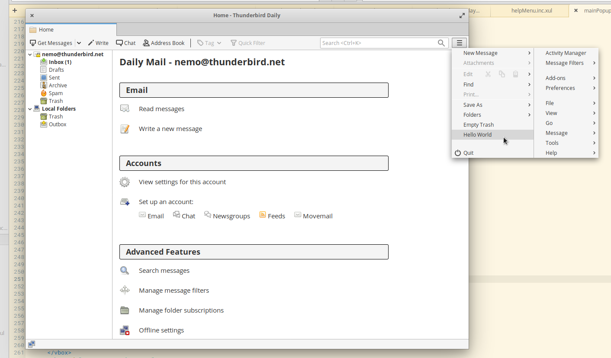

# Hello World

## Making Hello World in Thunderbird!

No project is a real project without a Hello World guide. In this guide we will create a function in JavaScript that triggers an alert that says "Hello World!" - then we will add a menu item that triggers that function. The idea is to give you a chance to dig through the code and make some fun changes beyond this guide, and learn how to change Thunderbird!

### function helloWorld\(\)

The first thing we want to do is create the function that will run and create our JavaScript alert - this alert will create a new window with our message: "Hello World!"

Open up `mailCore.js` - this is the file that we'll be creating our function in. You can find this file in the content folder which is here: `comm -> mail -> base -> content`.

We can put our function almost anywhere in this file, so long as we don't put it within another function. Take a little while to look at this file and see if you can figure out what the other functions in this file are doing. Once you've done that find the function `openAboutSupport()`. If you are new to programming you can find this function easily is most editors by doing a search with **ctrl+f** to open up a search field - you can put `openAboutSupport()` in there and it should highlight that function. 

After you find that function place the following code below it:

```text
function helloWorld(){
  alert('Hello, World!');
}
```

As noted above, this is a JavaScript function that will create an alert that will appear in the form of a window that Thunderbird generates that will say "Hello World!"

This is what it should look like in context:



```text
function openAboutSupport() {
  let tabmail = document.getElementById("tabmail");
  tabmail.openTab("contentTab", {contentPage: "about:support",
                  clickHandler: "specialTabs.aboutClickHandler(event);" });
}

function helloWorld(){
  alert('Hello, World!');
}
```



### Triggering Hello World

For this tutorial we are going to create a new menu item in the app menu \(often called the hamburger menu\) to call our `helloWorld()` function in `mailCore.js`.


For this part of the tutorial we are going to interact with a XUL file. **XUL** \(XML User Interface Language\) is Mozilla's XML-based language for building user interfaces of applications.


In the same directory that we found `mailCore.js` - we are going to open the file `mainPopupSet.inc.xul` and find the `"appmenu_emptyTrash"` menuitem \(you'll likely want to use **Ctrl+F** again to find it\).

Once you found the `appmenu_emptyTrash` menuitem, insert the following code below it:

```text
<menuitem id="helloWorld"
          label="Hello World"
          oncommand="helloWorld();"/>
```

In context:



```text
<menuitem id="appmenu_emptyTrash"
          label="&emptyTrashCmd.label;"
          command="cmd_emptyTrash"/>
<menuitem id="helloWorld"
          label="Hello World"
          oncommand="helloWorld();"/>
```



### Trying it Out

Make sure all your work is saved and then you can build Thunderbird using the `./mach build` command. Once you have built Thunderbird with the changes, we can use `./mach run` to try out our modified version of Thunderbird.

Click to open the App Menu on the right hand side and you should see "Hello World" \(pictured below\):



When you click on the "Hello World" menu item, you should get an alert prompt \(pictured below\):


If that alert window appears when you click the menu item then it works!

### What's Next

Spend some time playing around with the menu and even try experimenting with the helloWorld function. Most of all have fun and don't worry about messing things up. 

If you get in trouble you can reset the repository via the commands below \(in the `/comm` directory\) - **these will remove all the changes you've made**:

```text
hg update --clean
```


